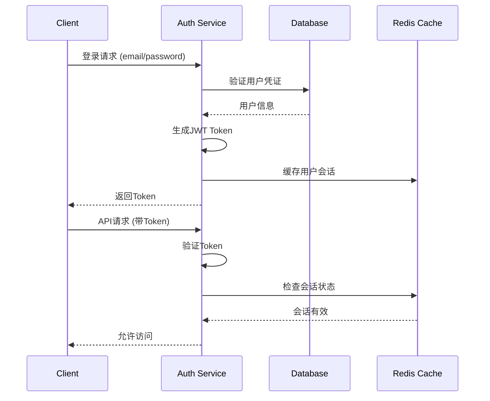

# 系统架构设计文档

## 架构概览

宠物护理预约系统采用经典的三层架构模式，结合现代微服务理念，确保系统的可扩展性、可维护性和高性能。

```
┌─────────────────────────────────────────────────────────────┐
│                    前端展示层 (Presentation Layer)              │
├─────────────────────────────────────────────────────────────┤
│  React 18 + Vite + Bootstrap                               │
│  ┌─────────────┐ ┌─────────────┐ ┌─────────────┐            │
│  │   患者端    │ │   兽医端    │ │   管理端    │            │
│  │  Patient   │ │ Veterinarian│ │   Admin     │            │
│  │    SPA     │ │     SPA     │ │    SPA      │            │
│  └─────────────┘ └─────────────┘ └─────────────┘            │
└─────────────────────────────────────────────────────────────┘
                            │ HTTP/HTTPS
┌─────────────────────────────────────────────────────────────┐
│                      Web服务层 (Web Layer)                    │
├─────────────────────────────────────────────────────────────┤
│  Nginx (反向代理/负载均衡/静态资源)                            │
│  ┌─────────────┐ ┌─────────────┐ ┌─────────────┐            │
│  │   SSL 终端  │ │  负载均衡器  │ │  静态资源   │            │
│  │ Termination │ │Load Balancer│ │   服务器    │            │
│  └─────────────┘ └─────────────┘ └─────────────┘            │
└─────────────────────────────────────────────────────────────┘
                            │ HTTP
┌─────────────────────────────────────────────────────────────┐
│                    应用服务层 (Application Layer)              │
├─────────────────────────────────────────────────────────────┤
│  Spring Boot 3.3.0 + Spring Security + JWT                │
│  ┌─────────────┐ ┌─────────────┐ ┌─────────────┐            │
│  │  API网关    │ │  认证服务    │ │  业务服务    │            │
│  │  Gateway   │ │    Auth     │ │  Business   │            │
│  └─────────────┘ └─────────────┘ └─────────────┘            │
│  ┌─────────────┐ ┌─────────────┐ ┌─────────────┐            │
│  │  邮件服务    │ │  文件服务    │ │  通知服务    │            │
│  │    Mail     │ │    File     │ │ Notification│            │
│  └─────────────┘ └─────────────┘ └─────────────┘            │
└─────────────────────────────────────────────────────────────┘
                            │ JDBC
┌─────────────────────────────────────────────────────────────┐
│                    数据持久层 (Data Layer)                     │
├─────────────────────────────────────────────────────────────┤
│  MySQL 8.0 + Redis (缓存)                                  │
│  ┌─────────────┐ ┌─────────────┐ ┌─────────────┐            │
│  │   主数据库   │ │   从数据库   │ │  Redis缓存  │            │
│  │   Master    │ │    Slave    │ │    Cache    │            │
│  │     DB      │ │     DB      │ │             │            │
│  └─────────────┘ └─────────────┘ └─────────────┘            │
└─────────────────────────────────────────────────────────────┘
```

## 技术架构栈

### 前端架构 (Frontend Architecture)

#### 核心技术
- **React 18**: 现代化的声明式UI框架
- **Vite**: 快速的构建工具和开发服务器
- **React Router DOM**: 客户端路由管理
- **Bootstrap 5**: 响应式UI组件库

#### 架构模式
```
src/
├── components/           # 组件层
│   ├── common/          # 通用组件
│   ├── layout/          # 布局组件
│   ├── auth/            # 认证相关组件
│   ├── appointment/     # 预约功能组件
│   ├── user/            # 用户管理组件
│   ├── veterinarian/    # 兽医功能组件
│   └── admin/           # 管理员组件
├── hooks/               # 自定义Hook
├── services/            # API服务层
├── utils/               # 工具函数
├── assets/              # 静态资源
└── App.jsx              # 应用根组件
```

#### 状态管理策略
```javascript
// 使用React Hooks进行状态管理
const useAppointment = () => {
  const [appointments, setAppointments] = useState([]);
  const [loading, setLoading] = useState(false);
  const [error, setError] = useState(null);
  
  const fetchAppointments = useCallback(async () => {
    setLoading(true);
    try {
      const response = await appointmentService.getAppointments();
      setAppointments(response.data);
    } catch (err) {
      setError(err.message);
    } finally {
      setLoading(false);
    }
  }, []);
  
  return { appointments, loading, error, fetchAppointments };
};
```

### 后端架构 (Backend Architecture)

#### 分层架构
```
com.dailycodework.universalpetcare/
├── controller/          # 控制层 (REST API)
│   ├── AuthController
│   ├── AppointmentController
│   ├── UserController
│   └── ...
├── service/             # 服务层 (业务逻辑)
│   ├── auth/
│   ├── appointment/
│   ├── user/
│   └── ...
├── repository/          # 数据访问层
│   ├── UserRepository
│   ├── AppointmentRepository
│   └── ...
├── model/               # 数据模型层
│   ├── User
│   ├── Appointment
│   └── ...
├── dto/                 # 数据传输对象
├── security/            # 安全配置
├── config/              # 配置类
└── exception/           # 异常处理
```

#### 核心服务模块

##### 1. 认证授权服务 (Authentication & Authorization)
```java
@Service
@RequiredArgsConstructor
public class AuthService {
    private final UserRepository userRepository;
    private final JwtTokenProvider tokenProvider;
    private final PasswordEncoder passwordEncoder;
    
    public AuthResponse login(LoginRequest request) {
        // 用户认证逻辑
        User user = authenticateUser(request);
        String token = tokenProvider.generateToken(user);
        return new AuthResponse(token, user);
    }
    
    public void register(RegisterRequest request) {
        // 用户注册逻辑
        User user = createUser(request);
        sendVerificationEmail(user);
    }
}
```

##### 2. 预约管理服务 (Appointment Service)
```java
@Service
@Transactional
public class AppointmentService {
    
    @EventListener
    public void handleAppointmentBooked(AppointmentBookedEvent event) {
        // 发送预约确认邮件
        emailService.sendAppointmentConfirmation(event.getAppointment());
    }
    
    public Appointment bookAppointment(BookAppointmentRequest request) {
        // 预约业务逻辑
        validateAppointmentTime(request);
        Appointment appointment = createAppointment(request);
        publisher.publishEvent(new AppointmentBookedEvent(appointment));
        return appointment;
    }
}
```

##### 3. 邮件通知服务 (Email Notification)
```java
@Service
@Async
public class EmailService {
    
    @Value("${app.base-url}")
    private String baseUrl;
    
    public void sendVerificationEmail(User user, String token) {
        String subject = "邮箱验证";
        String verificationUrl = baseUrl + "/verify-email?token=" + token;
        String content = buildVerificationEmailContent(user.getFirstName(), verificationUrl);
        sendEmail(user.getEmail(), subject, content);
    }
}
```

## 安全架构 (Security Architecture)

### 认证流程


### JWT Token 结构
```json
{
  "header": {
    "alg": "HS256",
    "typ": "JWT"
  },
  "payload": {
    "sub": "user@example.com",
    "userId": 1,
    "roles": ["ROLE_PATIENT"],
    "iat": 1640995200,
    "exp": 1641081600
  }
}
```

### 权限控制矩阵
| 资源/操作 | 患者 | 兽医 | 管理员 |
|----------|------|------|--------|
| 查看预约 | ✓ (自己的) | ✓ (相关的) | ✓ (所有) |
| 创建预约 | ✓ | ✗ | ✓ |
| 确认预约 | ✗ | ✓ | ✓ |
| 用户管理 | ✗ | ✗ | ✓ |
| 系统统计 | ✗ | ✓ (个人) | ✓ (全部) |

## 数据架构 (Data Architecture)

### 数据流图
```
┌─────────────┐    HTTP/JSON    ┌─────────────┐
│   Frontend  │◄───────────────►│   Backend   │
│   (React)   │    REST API     │ (Spring)    │
└─────────────┘                 └─────────────┘
                                        │
                                   JDBC/JPA
                                        │
                                        ▼
┌─────────────┐                 ┌─────────────┐
│    Redis    │◄────────────────┤    MySQL    │
│   (Cache)   │   Session/Cache │ (Database)  │
└─────────────┘                 └─────────────┘
```

### 缓存策略
```java
@Configuration
@EnableCaching
public class CacheConfig {
    
    @Bean
    public CacheManager cacheManager() {
        RedisCacheManager.Builder builder = RedisCacheManager
            .RedisCacheManagerBuilder
            .fromConnectionFactory(redisConnectionFactory())
            .cacheDefaults(cacheConfiguration());
        return builder.build();
    }
    
    private RedisCacheConfiguration cacheConfiguration() {
        return RedisCacheConfiguration.defaultCacheConfig()
            .entryTtl(Duration.ofMinutes(10))
            .serializeKeysWith(RedisSerializationContext.SerializationPair
                .fromSerializer(new StringRedisSerializer()))
            .serializeValuesWith(RedisSerializationContext.SerializationPair
                .fromSerializer(new GenericJackson2JsonRedisSerializer()));
    }
}
```

## 部署架构 (Deployment Architecture)

### Docker 容器化部署
```yaml
# docker-compose.yml
version: "3.8"
services:
  # 数据库层
  db:
    image: mysql:8
    environment:
      MYSQL_ROOT_PASSWORD: ${DB_PASSWORD}
      MYSQL_DATABASE: pet-care-system
    volumes:
      - mysql_data:/var/lib/mysql
    networks:
      - pet-care-network
  
  # 缓存层
  redis:
    image: redis:alpine
    command: redis-server --requirepass ${REDIS_PASSWORD}
    networks:
      - pet-care-network
  
  # 应用层
  backend:
    build: ./backend
    environment:
      SPRING_PROFILES_ACTIVE: prod
      SPRING_DATASOURCE_URL: jdbc:mysql://db:3306/pet-care-system
      SPRING_REDIS_HOST: redis
    depends_on:
      - db
      - redis
    networks:
      - pet-care-network
  
  # 前端层
  frontend:
    build: ./frontend
    networks:
      - pet-care-network
  
  # 反向代理层
  nginx:
    image: nginx:alpine
    ports:
      - "80:80"
      - "443:443"
    volumes:
      - ./nginx.conf:/etc/nginx/nginx.conf
      - ./ssl:/etc/ssl/certs
    depends_on:
      - backend
      - frontend
    networks:
      - pet-care-network

networks:
  pet-care-network:
    driver: bridge

volumes:
  mysql_data:
```

### Kubernetes 部署 (可选)
```yaml
# deployment.yaml
apiVersion: apps/v1
kind: Deployment
metadata:
  name: pet-care-backend
spec:
  replicas: 3
  selector:
    matchLabels:
      app: pet-care-backend
  template:
    metadata:
      labels:
        app: pet-care-backend
    spec:
      containers:
      - name: backend
        image: pet-care/backend:latest
        ports:
        - containerPort: 9192
        env:
        - name: SPRING_PROFILES_ACTIVE
          value: "k8s"
        - name: SPRING_DATASOURCE_URL
          valueFrom:
            secretKeyRef:
              name: db-secret
              key: url
```

## 监控与运维 (Monitoring & Operations)

### 应用监控
```java
// 使用Spring Boot Actuator
@Component
public class AppointmentHealthIndicator implements HealthIndicator {
    
    @Autowired
    private AppointmentService appointmentService;
    
    @Override
    public Health health() {
        try {
            long pendingCount = appointmentService.getPendingAppointmentCount();
            if (pendingCount > 100) {
                return Health.down()
                    .withDetail("pendingAppointments", pendingCount)
                    .withDetail("reason", "Too many pending appointments")
                    .build();
            }
            return Health.up()
                .withDetail("pendingAppointments", pendingCount)
                .build();
        } catch (Exception e) {
            return Health.down(e).build();
        }
    }
}
```

### 日志架构
```yaml
# logback-spring.xml
<configuration>
    <appender name="STDOUT" class="ch.qos.logback.core.ConsoleAppender">
        <encoder class="net.logstash.logback.encoder.LoggingEventCompositeJsonEncoder">
            <providers>
                <timestamp/>
                <logLevel/>
                <loggerName/>
                <message/>
                <mdc/>
                <stackTrace/>
            </providers>
        </encoder>
    </appender>
    
    <appender name="FILE" class="ch.qos.logback.core.rolling.RollingFileAppender">
        <file>logs/pet-care.log</file>
        <rollingPolicy class="ch.qos.logback.core.rolling.TimeBasedRollingPolicy">
            <fileNamePattern>logs/pet-care.%d{yyyy-MM-dd}.gz</fileNamePattern>
            <maxHistory>30</maxHistory>
        </rollingPolicy>
        <encoder>
            <pattern>%d{HH:mm:ss.SSS} [%thread] %-5level %logger{36} - %msg%n</pattern>
        </encoder>
    </appender>
    
    <root level="INFO">
        <appender-ref ref="STDOUT"/>
        <appender-ref ref="FILE"/>
    </root>
</configuration>
```

## 性能优化策略

### 数据库优化
```sql
-- 查询优化
EXPLAIN SELECT a.*, u1.first_name as patient_name, u2.first_name as vet_name
FROM appointment a
JOIN user u1 ON a.sender = u1.id
JOIN user u2 ON a.recipient = u2.id
WHERE a.appointment_date BETWEEN '2024-01-01' AND '2024-12-31'
AND a.status = 'APPROVED';

-- 索引优化
CREATE INDEX idx_appointment_date_status ON appointment(appointment_date, status);
CREATE INDEX idx_user_type_enabled ON user(user_type, is_enabled);
```

### 应用层优化
```java
// 使用@Cacheable减少数据库查询
@Service
public class VeterinarianService {
    
    @Cacheable(value = "veterinarians", key = "'all'")
    public List<VeterinarianResponse> getAllVeterinarians() {
        return veterinarianRepository.findAll()
            .stream()
            .map(this::convertToResponse)
            .collect(Collectors.toList());
    }
    
    @CacheEvict(value = "veterinarians", allEntries = true)
    public VeterinarianResponse updateVeterinarian(Long id, UpdateVetRequest request) {
        // 更新逻辑
    }
}
```

### 前端优化
```javascript
// 使用React.memo优化组件渲染
const AppointmentCard = React.memo(({ appointment, onStatusChange }) => {
  return (
    <Card>
      <Card.Body>
        <Card.Title>{appointment.appointmentNo}</Card.Title>
        <Card.Text>{appointment.reason}</Card.Text>
        <Button onClick={() => onStatusChange(appointment.id, 'APPROVED')}>
          批准
        </Button>
      </Card.Body>
    </Card>
  );
}, (prevProps, nextProps) => {
  return prevProps.appointment.id === nextProps.appointment.id &&
         prevProps.appointment.status === nextProps.appointment.status;
});

// 使用虚拟滚动处理大量数据
import { FixedSizeList as List } from 'react-window';

const AppointmentList = ({ appointments }) => {
  const Row = ({ index, style }) => (
    <div style={style}>
      <AppointmentCard appointment={appointments[index]} />
    </div>
  );

  return (
    <List
      height={600}
      itemCount={appointments.length}
      itemSize={120}
    >
      {Row}
    </List>
  );
};
```

## 扩展性设计

### 微服务拆分策略
```
当前单体应用 → 微服务架构

┌─────────────────┐
│   Monolithic    │
│   Application   │
└─────────────────┘
          │
          ▼
┌─────────────────┐ ┌─────────────────┐ ┌─────────────────┐
│   User Service  │ │Appointment Srv. │ │Notification Srv.│
│                 │ │                 │ │                 │
├─────────────────┤ ├─────────────────┤ ├─────────────────┤
│ • User Mgmt     │ │ • Booking       │ │ • Email         │
│ • Authentication│ │ • Scheduling    │ │ • SMS           │
│ • Authorization │ │ • Status Mgmt   │ │ • Push          │
└─────────────────┘ └─────────────────┘ └─────────────────┘
```

### API版本控制
```java
@RestController
@RequestMapping("/api/v1/appointments")
public class AppointmentControllerV1 {
    // V1 API实现
}

@RestController
@RequestMapping("/api/v2/appointments")
public class AppointmentControllerV2 {
    // V2 API实现，支持新功能
}
```

这个系统架构设计确保了系统的可扩展性、可维护性和高性能，为未来的功能扩展和技术升级提供了坚实的基础。